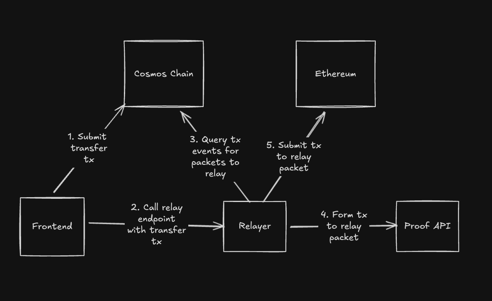
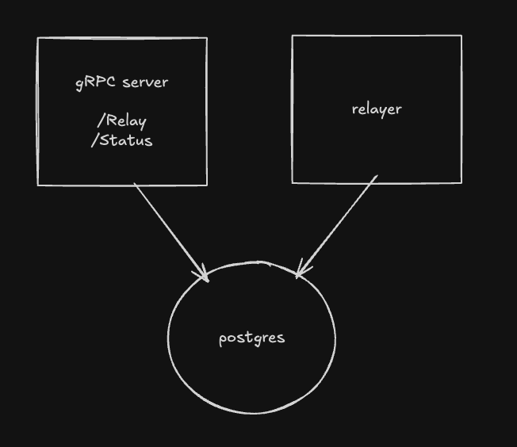

# IBC v2 Relayer

IBC v2 Relayer is a relaying service for the IBC v2 Protocol. The relayer supports interoperating between a Cosmos-based chain and major EVM networks.

## Relaying Sequence


## Supported Features

- Compatible with all major EVM chains (Ethereum, Base, Optimism, Arbitrum, Polygon, and more)
- Request-driven design for configurable, on-demand relaying
- Transaction failure retry support
  - Re-orgs
  - Out-of-gas
  - Inadequate gas price
  - Tx network propagation fails to reach leader
  - Invalid by the network, but valid by the submitting node
- Transaction Tracking API
- Remote signing support
- Configurable packet delivery latency via batching
- Ability to blacklist addresses (ex: OFAC)
- Transaction cost tracking

## Getting Started

### Prerequisites

- Go 1.24+
- Docker and Docker Compose
- A running [proof API](https://github.com/cosmos/solidity-ibc-eureka/tree/main/programs/relayer) (attestor) service
- RPC endpoints for the chains you want to relay between

### Local Development

1. Start Postgres and run migrations:
```bash
docker-compose up -d
```

2. Create a local config file (see [Configuration Reference](#configuration-reference) below).

3. Create a local keys file (see [Local Signing](#local-signing) below).

4. Run the relayer:
```bash
make relayer-local
```

The relayer will start:
- gRPC API server on the address configured in `relayer_api.address`
- Prometheus metrics server on the configured address
- Relay dispatcher polling for new transfers

### CLI Flags

| Flag | Default | Description |
|------|---------|-------------|
| `--config` | `./config/local/config.yml` | Path to relayer config file |
| `--eureka-relaying` | `true` | Enable/disable the relay dispatcher |

### Running Tests

```bash
make test
```

## Design


The relayer has three main components - the gRPC server which clients use to interact with the relayer, a postgres db, and the core relayer. The gRPC server populates the db with packets, which the core relayer monitors and updates as it progresses in relaying those packets.

## API Interface
The relayer serves a gRPC server which clients use to specify what packets to relay and track packet relaying progress.

```proto
service RelayerApiService {
    // Relay is used to specify a source tx hash for packets the relayer should relay.
    // The relayer will identify all packets created by the transaction and attempt to relay them all.
    rpc Relay(RelayRequest) returns (RelayResponse) {}

    // The status endpoint is used to track the progress of packet relaying.
    // It takes a transaction hash and returns the status of any relevant packets the relayer is aware of.
    // The transaction must first have been passed to the relay endpoint.
    rpc Status(StatusRequest) returns (StatusResponse) {}
}

message StatusRequest {
    string tx_hash = 1;
    string chain_id = 2;
}

enum TransferState {
    TRANSFER_STATE_UNKNOWN = 0;
    TRANSFER_STATE_PENDING = 1;
    TRANSFER_STATE_COMPLETE = 2;
    TRANSFER_STATE_FAILED = 3;
}

message TransactionInfo {
    string tx_hash = 1;
    string chain_id = 2;
}

message PacketStatus {
    TransferState state = 1;
    uint64 sequence_number = 2;
    string source_client_id = 3;
    TransactionInfo send_tx = 4;
    TransactionInfo recv_tx = 5;
    TransactionInfo ack_tx = 6;
    TransactionInfo timeout_tx = 7;
}

message StatusResponse {
    repeated PacketStatus packet_statuses = 1;
}

message RelayRequest {
    string tx_hash = 1;
    string chain_id = 2;
}

message RelayResponse {}
```

## Observability

| Type      | Name                                   | Description |
|-----------|----------------------------------------|-------------|
| Metric    | Relayer api request count               | Paginated by method and response code |
| Metric    | Relayer api request latency             | Paginated by method |
| Metric    | Transfer count                          | Paginated by source, destination chain, and transfer state |
| Metric    | Relayer gas balance                     | Paginated by chain and gas token |
| Metric    | Relayer gas balance state               | A gauge where each value represents a gas balance state. 0 = ok, 1 = warning, 2 = critical. The thresholds that define each state are defined in the relayer configuration. Paginated by chain |
| Metric    | External request count                  | Paginated by endpoint, method and response code |
| Metric    | External request latency                | Paginated by endpoint and method |
| Metric    | Transactions submitted counter          | Paginated by node response success status and chain |
| Metric    | Transaction retry counter               | Paginated by source and destination chain |
| Metric    | Transactions confirmed counter          | Paginated by execution success and chain |
| Metric    | Transaction gas cost counter            | Paginated by chain |
| Metric    | Relay latency                           | Time between send tx and ack/timeout tx. Paginated by source and destination chain |
| Metric    | Detected client update required counter | Paginated by chain |
| Metric    | Client updated counter                  | Paginated by chain |
| Metric    | Excessive relay latency counter         | Incremented anytime a transfer is pending for longer than some configured threshold. Paginated by source and destination chain |
| Alert     | Excessive relay latency                 | Should alert whenever the excessive relay latency counter increases |
| Alert     | Excessive gas usage                     | Should alert whenever the gas cost counter increases faster than some threshold |
| Alert     | Low gas balance                         | Should alert whenever the relayer gas balance state metric is in the warning or critical state |

## Configuration Reference

The relayer is configured via a YAML file. Below is the complete configuration schema with all available options.

### Full Example

```yaml
postgres:
  hostname: localhost
  port: "5432"
  database: relayer

metrics:
  prometheus_address: "0.0.0.0:8888"

relayer_api:
  address: "0.0.0.0:9000"

eureka_proof_api:
  grpc_address: "localhost:50051"
  grpc_tls_enabled: false

signing:
  # Local signing — set keys_path to use local key file
  keys_path: "./config/local/eurekakeys.json"
  # Remote signing — set grpc_address to use remote signer (takes precedence over keys_path)
  # grpc_address: "localhost:50052"
  # cosmos_wallet_key: "cosmos-wallet-id"
  # evm_wallet_key: "evm-wallet-id"
  # svm_wallet_key: "svm-wallet-id"

coingecko:
  base_url: "https://pro-api.coingecko.com/api/v3"
  api_key: "your-api-key"
  requests_per_minute: 30
  cache_refresh_interval: 5m

chains:
  cosmoshub:
    chain_name: "cosmoshub"
    chain_id: "cosmoshub-4"
    type: "cosmos"
    environment: "mainnet"
    gas_token_symbol: "ATOM"
    gas_token_coingecko_id: "cosmos"
    gas_token_decimals: 6
    supported_bridges:
      - eureka
    cosmos:
      eureka_tx_fee_denom: "uatom"
      eureka_tx_fee_amount: 5000
      rpc: "https://cosmos-rpc.example.com"
      rpc_basic_auth_var: "COSMOS_RPC_AUTH"
      grpc: "cosmos-grpc.example.com:9090"
      grpc_tls_enabled: true
      address_prefix: "cosmos"
    eureka:
      counterparty_chains:
        "08-wasm-0": "1"   # client ID on cosmoshub → ethereum chain ID
      finality_offset: 10
      recv_batch_size: 50
      recv_batch_timeout: 10s
      recv_batch_concurrency: 3
      ack_batch_size: 50
      ack_batch_timeout: 10s
      ack_batch_concurrency: 3
      timeout_batch_size: 50
      timeout_batch_timeout: 10s
      timeout_batch_concurrency: 3
      should_relay_success_acks: true
      should_relay_error_acks: true
    signer_gas_alert_thresholds:
      eureka:
        warning_threshold: "5000000"    # in smallest denom units (uatom)
        critical_threshold: "1000000"

  ethereum:
    chain_name: "ethereum"
    chain_id: "1"
    type: "evm"
    environment: "mainnet"
    gas_token_symbol: "ETH"
    gas_token_coingecko_id: "ethereum"
    gas_token_decimals: 18
    supported_bridges:
      - eureka
    evm:
      rpc: "https://eth-mainnet.g.alchemy.com/v2/your-key"
      rpc_basic_auth_var: "ETH_RPC_AUTH"
      contracts:
        ics_26_router_address: "0x..."
        ics_20_transfer_address: "0x..."
      gas_fee_cap_multiplier: 1.5
      gas_tip_cap_multiplier: 1.2
    eureka:
      counterparty_chains:
        "tendermint-0": "cosmoshub-4"   # client ID on ethereum → cosmoshub chain ID
      recv_batch_size: 100
      recv_batch_timeout: 10s
      recv_batch_concurrency: 3
      ack_batch_size: 100
      ack_batch_timeout: 10s
      ack_batch_concurrency: 3
      timeout_batch_size: 100
      timeout_batch_timeout: 10s
      timeout_batch_concurrency: 3
      should_relay_success_acks: true
      should_relay_error_acks: true
    signer_gas_alert_thresholds:
      eureka:
        warning_threshold: "1000000000000000000"   # 1 ETH
        critical_threshold: "500000000000000000"   # 0.5 ETH
```

### Section Reference

#### `postgres`

| Field | Type | Description |
|-------|------|-------------|
| `hostname` | string | Postgres host |
| `port` | string | Postgres port |
| `database` | string | Database name |

Database credentials are read from environment variables `POSTGRES_USER` and `POSTGRES_PASSWORD` (default: `relayer`/`relayer`).

#### `metrics`

| Field | Type | Description |
|-------|------|-------------|
| `prometheus_address` | string | Address to serve Prometheus metrics (e.g. `0.0.0.0:8888`) |

#### `relayer_api`

| Field | Type | Description |
|-------|------|-------------|
| `address` | string | Address for the gRPC API server to listen on (e.g. `0.0.0.0:9000`) |

#### `eureka_proof_api`

Connection to the proof api service that generates relay transactions.

| Field | Type | Description |
|-------|------|-------------|
| `grpc_address` | string | gRPC address of the proof API |
| `grpc_tls_enabled` | bool | Enable TLS for the proof API connection |

#### `signing`

Signing configuration. The mode is inferred from which fields are set:
- If `grpc_address` is set → remote signing (ignores `keys_path`)
- Else if `keys_path` is set → local signing from key file
- Else → fatal error at startup

| Field | Type | Description |
|-------|------|-------------|
| `keys_path` | string | Path to local signing keys JSON file |
| `grpc_address` | string | gRPC address of the remote signer service. If set, takes precedence over `keys_path` |
| `cosmos_wallet_key` | string | Wallet ID for Cosmos chain signing (remote signer only) |
| `evm_wallet_key` | string | Wallet ID for EVM chain signing (remote signer only) |
| `svm_wallet_key` | string | Wallet ID for Solana chain signing (remote signer only) |

#### `coingecko` (optional)

Used for tracking transaction gas costs in USD. If omitted, gas cost tracking is disabled.

| Field | Type | Description |
|-------|------|-------------|
| `base_url` | string | Coingecko API base URL |
| `api_key` | string | API key |
| `requests_per_minute` | int | Rate limit |
| `cache_refresh_interval` | duration | How often to refresh cached prices |

#### `chains.<chain_key>`

Each entry under `chains` defines a chain the relayer can interact with.

| Field | Type | Description                                           |
|-------|------|-------------------------------------------------------|
| `chain_name` | string | Human-readable chain name. Used primarily in metrics. |
| `chain_id` | string | Chain identifier (numeric for EVM, string for Cosmos) |
| `type` | string | `cosmos`, `evm`, or `svm`                             |
| `environment` | string | `mainnet` or `testnet`                                |
| `gas_token_symbol` | string | Gas token ticker symbol                               |
| `gas_token_coingecko_id` | string | Coingecko ID for gas cost tracking (optional)         |
| `gas_token_decimals` | uint8 | Decimal places for the gas token                      |
| `supported_bridges` | []string | List of bridge types (currently only `eureka`)        |

#### `chains.<chain_key>.cosmos`

Required when `type: cosmos`.

| Field | Type | Description |
|-------|------|-------------|
| `gas_price` | float64 | Gas price for fee estimation. Mutually exclusive with `eureka_tx_fee_amount` |
| `eureka_tx_fee_denom` | string | Fee denom for eureka txs (required if `eureka_tx_fee_amount` is set) |
| `eureka_tx_fee_amount` | uint64 | Fixed fee amount for eureka txs. Mutually exclusive with `gas_price` |
| `rpc` | string | Tendermint RPC endpoint |
| `rpc_basic_auth_var` | string | Environment variable name containing basic auth credentials for RPC |
| `grpc` | string | gRPC endpoint |
| `grpc_tls_enabled` | bool | Enable TLS for gRPC |
| `address_prefix` | string | Bech32 address prefix (e.g. `cosmos`, `osmo`) |

#### `chains.<chain_key>.evm`

Required when `type: evm`.

| Field | Type | Description |
|-------|------|-------------|
| `rpc` | string | Ethereum JSON-RPC endpoint |
| `rpc_basic_auth_var` | string | Environment variable name containing basic auth credentials for RPC |
| `contracts.ics_26_router_address` | string | ICS26 Router contract address |
| `contracts.ics_20_transfer_address` | string | ICS20 Transfer contract address |
| `gas_fee_cap_multiplier` | float64 | Multiplier applied to the estimated gas fee cap (optional) |
| `gas_tip_cap_multiplier` | float64 | Multiplier applied to the estimated gas tip cap (optional) |

#### `chains.<chain_key>.eureka`

IBC v2 relay configuration for this chain. Defines which counterparty chains to relay for and batching behavior.

| Field | Type | Description |
|-------|------|-------------|
| `counterparty_chains` | map[string]string | Maps client IDs on this chain to their counterparty chain IDs. Only connections listed here will be relayed |
| `finality_offset` | uint64 | Number of blocks to wait after a tx before considering it finalized. If omitted, uses the chain's native finality (e.g. `finalized` block tag for EVM) |
| `recv_batch_size` | int | Max packets to accumulate before flushing a recv batch |
| `recv_batch_timeout` | duration | Max time to wait for recv packets to accumulate before flushing |
| `recv_batch_concurrency` | int | Max concurrent recv batches being processed |
| `ack_batch_size` | int | Max packets to accumulate before flushing an ack batch |
| `ack_batch_timeout` | duration | Max time to wait for ack packets to accumulate before flushing |
| `ack_batch_concurrency` | int | Max concurrent ack batches being processed |
| `timeout_batch_size` | int | Max packets to accumulate before flushing a timeout batch |
| `timeout_batch_timeout` | duration | Max time to wait for timeout packets to accumulate before flushing |
| `timeout_batch_concurrency` | int | Max concurrent timeout batches being processed |
| `should_relay_success_acks` | bool | Whether to relay acknowledgements for successful packet deliveries |
| `should_relay_error_acks` | bool | Whether to relay acknowledgements for failed packet deliveries |

#### `chains.<chain_key>.signer_gas_alert_thresholds`

| Field | Type | Description |
|-------|------|-------------|
| `eureka.warning_threshold` | string | Gas balance (in smallest denom) at which the metric reports warning state |
| `eureka.critical_threshold` | string | Gas balance (in smallest denom) at which the metric reports critical state |

## Signing

The relayer supports two signing modes, configured via the `signing` block in the YAML config. The mode is inferred from which fields are populated:

- If `grpc_address` is set → **remote signing** (ignores `keys_path`)
- Else if `keys_path` is set → **local signing** from key file
- Else → fatal error at startup

### Local Signing

Set `signing.keys_path` to point to a JSON file containing private keys. The format is a map of chain IDs to key objects:

```yaml
signing:
  keys_path: "./config/local/eurekakeys.json"
```

```json
{
  "1": {
    "private_key": "0xabc123..."
  },
  "cosmoshub-4": {
    "private_key": "abc123..."
  }
}
```

For EVM chains, the private key is a hex-encoded ECDSA private key. For Cosmos chains, it is a hex-encoded secp256k1 private key.

### Remote Signing

For production deployments, the relayer can delegate signing to an external gRPC service. This keeps private keys isolated from the relayer process.

#### Configuration

```yaml
signing:
  grpc_address: "signer.internal:50052"
  cosmos_wallet_key: "my-cosmos-wallet"
  evm_wallet_key: "my-evm-wallet"
  svm_wallet_key: "my-svm-wallet"
```

#### Authentication

The remote signer connection uses the `SERVICE_ACCOUNT_TOKEN` environment variable as a bearer token in gRPC metadata for authenticating requests to the signing service.

#### Signer Service Interface

The remote signer must implement the following gRPC service:

```proto
service SignerService {
    rpc GetChains(GetChainsRequest) returns (GetChainsResponse) {}
    rpc GetWallet(GetWalletRequest) returns (GetWalletResponse) {}
    rpc GetWallets(GetWalletsRequest) returns (GetWalletsResponse) {}
    rpc Sign(SignRequest) returns (SignResponse) {}
}
```

The `Sign` RPC accepts transaction payloads for EVM, Cosmos, and Solana chains and returns the appropriate signature format for each:

- **EVM**: Accepts serialized tx bytes + chain ID, returns `(r, s, v)` signature components
- **Cosmos**: Accepts sign doc bytes, returns a raw signature
- **Solana**: Accepts a base64-encoded transaction, returns a raw signature

The full proto definition is at [`proto/signer/signerservice.proto`](proto/signer/signerservice.proto).

#### Implementing a Compatible Signer Service

To implement your own signer service, refer to the proto file for message formats and signature requirements.

**Methods used by the relayer:**
- `GetWallet` - called at startup to retrieve public keys (uses `Cosmos`, `Ethereum`, and `Solana` pubkey types)
- `Sign` - called for every transaction

**Methods not used by the relayer:**
- `GetChains` - can return an empty response
- `GetWallets` - can return an empty response

**Sign payload types used by the relayer:**
- `EvmTransaction` / `EvmTransactionSignature`
- `CosmosTransaction` / `CosmosTransactionSignature`

**Sign payload types not used by the relayer:**
- `RawMessage` / `RawMessageSignature`
- `SolanaTransaction` / `SolanaTransactionSignature`


**Authentication:** The relayer sends the `SERVICE_ACCOUNT_TOKEN` environment variable as a bearer token in the `authorization` gRPC metadata header. Validation is optional.


